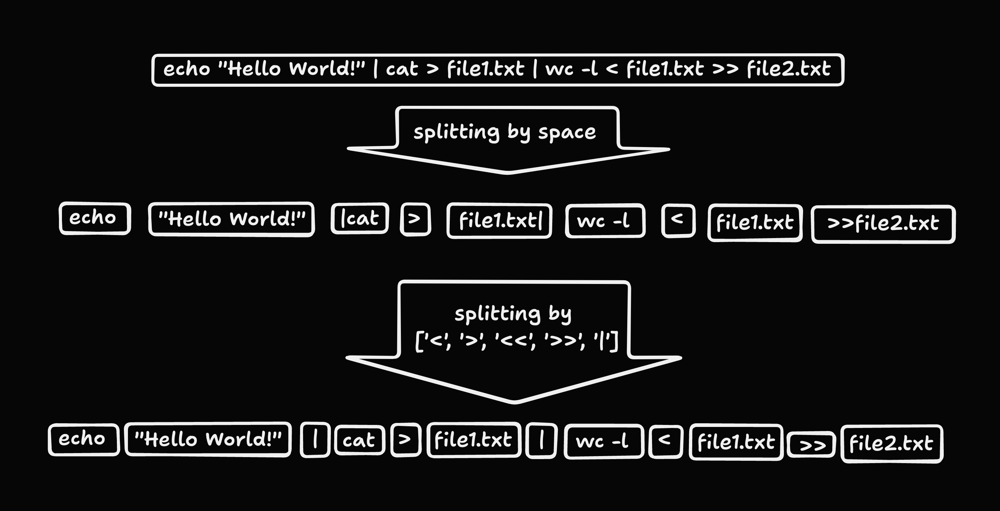

# Mini Shell (As Beautiful as a Shell)

## Navigation

1. [Introduction](#introduction)
2. [Parsing](#parsing)
    1. [Splitting](#splitting)
    2. [Identifying](#identifying)

## Introduction

The objective of this project is to implement a simple shell in **`C`**. This shell will handle various signals, special characters, and environment variables.

## Parsing

### Splitting

To parse the input prompt line, we first split the string by **spaces** outside of any quotes.

Subsequently, we iterate over the resulting list and further split any node that contains a redirection character, such as [**`<`**, **`>`**, **`>>`**, **`<<`**, **`|`**].

The process will result in a structure resembling the following:

---

### Identifying

In this phase, we identify the pipe **`|`** and the redirections [**`<`**, **`>`**, **`>>`**, **`<<`**].

1. If we encounter one of [**`<`**, **`>`**, **`>>`**], it signifies that the subsequent node will be a **file**. 
2. If we encounter **`<<`**, it indicates that the next node is a **delimiter** for the **heredoc**.
3. If we encounter **`|`**, it signifies that the next set of nodes, up to the next **`|`** or the end of the list, forms a separate command.

We then split the list at the **`|`** node if it exists; otherwise, we handle it as a single command.

> **Note:** If the first or the last node is **`|`**, or if we find a **`|`** immediately following a redirection [**`<`**, **`>`**, **`>>`**, **`<<`**], it results in a syntax error.

Next, we identify the **command** to be executed. This step is straightforward because we have already determined the positions of the **pipe** and the **redirections**.

1. To locate the **command**, we skip any node that has already been identified.
2. The first unidentified node encountered is deemed to hold our **command**.

Finally, we identify the flags and arguments.

1. After the command node, any unidentified node starting with `-` is considered a **flag**.
2. Any other unidentified node is considered an **argument**.

> **Note:** If a **flag** is found after an **argument**, it constitutes an error.

---
