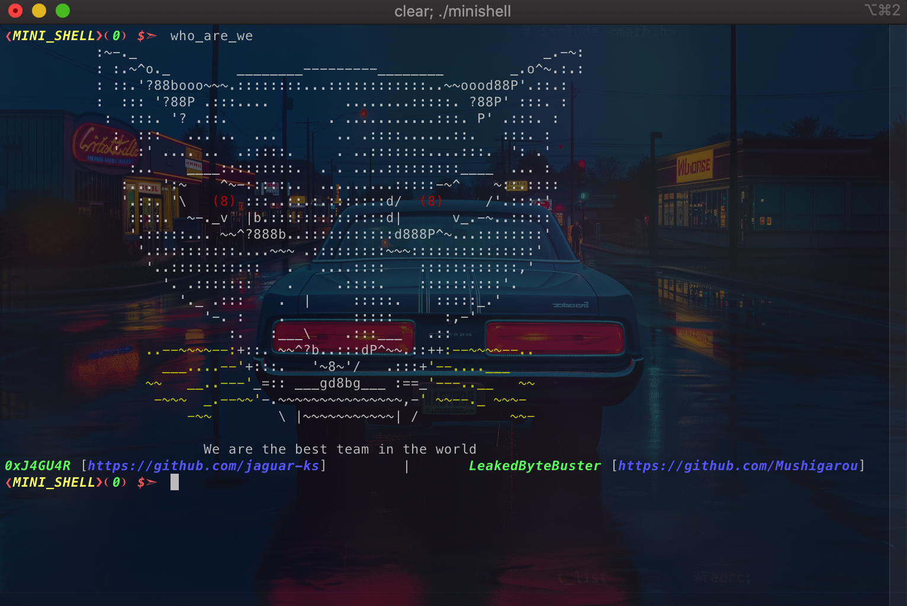

# Mini Shell (As Beautiful as a Shell)

## Navigation

1. [Introduction](#introduction)
1. [Instalation and Usage](#instalation-and-usage)
    1. [Instalation](#instalation)
    1. [Usage](#usage)
1. [Parsing](#parsing)
    1. [Splitting](#splitting)
    1. [Identifying](#identifying)
1. [Execution](#overview)
    1. [Command Execution](#command-execution)
    1. [Child Process Management](#child-process-management)
    1. [Initialization](#initialization)
    1. [Child Execution](#child-execution)
    1. [Pipeline Execution](#pipeline-execution)
    1. [Redirection Handling](#redirection-handling)
    1. [Path Resolution](#path-resolution)
    1. [Pipe Handling](#pipe-handling)
    1. [File Descriptor Management](#file-descriptor-management)
1. [Author & Final mark](#author--final-mark)

## Introduction

This project aims to implement a shell in **`C Language`** that mimics the Bash shell.

Some features :
- Parses command pipeline
- Executes a command pipeline
- Handles special characters
- Handles environment variables
- Handles single and double quotes `''` `""`
- Handles signals
- Redirection `>` `<` `>>`
- Heredocument `<<`
- handles pipes `|`
- Builtin commands `echo`, `cd`, `pwd`...

## Instalation and Usage

###  Run With Docker

```bash
$> make docker
```

### Manuel Installation


```bash
$> git clone 'git@github.com:jaguar-ks/MINI_SHELL.git'
$> cd MINI_SHELL
# ***`MacOS`*** : make sure you have the ***`readline`*** library installed (https://github.com/kube/42homebrew)
$> brew install readline
# ***`Debian`*** : make sure you have the ***`libreadline-dev && pkg-config`*** packages installed
$> apt update && apt install -y pkg-config
# Now you can compile and run the binary
$> make && ./minishell
```



## Parsing

### Splitting

To parse the input prompt line, we first split the string by **spaces** outside of any quotes.

Subsequently, we iterate over the resulting list and further split any node that contains a redirection character, such as [**`<`**, **`>`**, **`>>`**, **`<<`**, **`|`**].

The process will result in a structure resembling the following:


---

### Identifying

In this phase, we identify the pipe **`|`** and the redirections [**`<`**, **`>`**, **`>>`**, **`<<`**].

1. If we encounter one of [**`<`**, **`>`**, **`>>`**], it signifies that the subsequent node will be a **file**.
2. If we encounter **`<<`**, it indicates that the next node is a **delimiter** for the **heredoc**.
3. If we encounter **`|`**, it signifies that the next set of nodes, up to the next **`|`** or the end of the list, forms a separate command.

We then split the list at the **`|`** node if it exists; otherwise, we handle it as a single command.

> **Note:** If the first or the last node is **`|`**, or if we find a **`|`** immediately following a redirection [**`<`**, **`>`**, **`>>`**, **`<<`**], it results in a syntax error.

Next, we identify the **command** to be executed. This step is straightforward because we have already determined the positions of the **pipe** and the **redirections**.

1. To locate the **command**, we skip any node that has already been identified.
2. The first unidentified node encountered is deemed to hold our **command**.

Finally, we identify the flags and arguments.

1. After the command node, any unidentified node starting with `-` is considered a **flag**.
2. Any other unidentified node is considered an **argument**.

> **Note:** If a **flag** is found after an **argument**, it constitutes an error.

---

## Overview

The execution part of the minishell project handles the running of parsed commands. It deals with executing built-in commands, managing child processes, handling file redirections and pipes, and ensuring proper cleanup of file descriptors. Below is an overview of the main components and their roles.

## Components

### Command Execution

- **_execute_command**: Executes a single command.
  - Checks if the command is a built-in, and if so, executes it.
  - If not, finds the command's path and uses `execve` to run it.
  - Handles errors if the command is not found.

---

### Child Process Management

- **wait_childs**: Waits for all child processes to finish execution.
  - Checks for segmentation faults and handles them accordingly.
  - Waits for all child processes and returns the last exit status.

---

### Initialization

- **init_var**: Initializes file descriptor variables for standard input and output.
  - Sets default values for input and output file descriptors and resets error flags.

---

### Child Execution

- **_execute_in_child**: Prepares and executes a command in a child process.
  - Sets up redirections using `dup2`.
  - Closes unnecessary file descriptors.
  - Executes the command.

---

### Pipeline Execution

- **execute_pipeline**: Manages the execution of a series of commands connected by pipes.
  - Initializes variables and opens necessary pipes and redirections.
  - Executes each command in the pipeline.
  - Waits for all child processes to finish.

---

### Redirection Handling

- **_handle_redirections**: Opens files for input and output redirections.
  - Handles different types of redirections (`<`, `>`, `>>`) and stores the file descriptors.
  - Manages error cases for file opening.

- **open_redirections**: Processes all redirections for a command pipeline.
  - Iterates through redirection tokens and applies them using `_handle_redirections`.

---

### Path Resolution

- **find_cmd**: Searches for the executable of a given command in the provided paths.
  - Checks for direct paths or searches within system paths.
  - Returns the full path if found, otherwise returns `NULL`.

- **get_cmd_path**: Retrieves the system `PATH` environment variable and uses it to find the command's executable.
  - Splits the `PATH` and uses `find_cmd` to locate the executable.

---

### Pipe Handling

- **open_pipes**: Sets up pipes between commands in a pipeline.
  - Creates pipes and assigns the input and output file descriptors accordingly.
  - Ensures proper connection of command outputs to subsequent command inputs.

---

### File Descriptor Management

- **close_file_descriptors**: Closes all open file descriptors except standard input, output, and error.
  - Ensures cleanup of file descriptors after command execution.

---

### Execution of All Commands

- **execute_all_commands**: Executes all commands in a given pipeline.
  - Forks processes for each command.
  - Executes commands in child processes and handles errors.
  - Waits for the last child process and updates the exit status.

---

## Execution Flow

1. **Initialization**:
   - Initialize file descriptors and error flags.
2. **Redirection and Pipe Setup**:
   - Open necessary redirections and pipes for the command pipeline.
3. **Command Execution**:
   - Execute each command in the pipeline, managing child processes and handling errors.
4. **Cleanup**:
   - Close all file descriptors and wait for child processes to complete.

This process ensures that commands are executed correctly, handling built-ins, external commands, redirections, and pipelines with proper resource management.

## Author & Final mark

This project was developed and validated by [`0xJ4GU4R`](https://github.com/jaguar-ks) and [`LeakedByteBuster`](https://github.com/LeakedByteBuster). With a final mark of:


